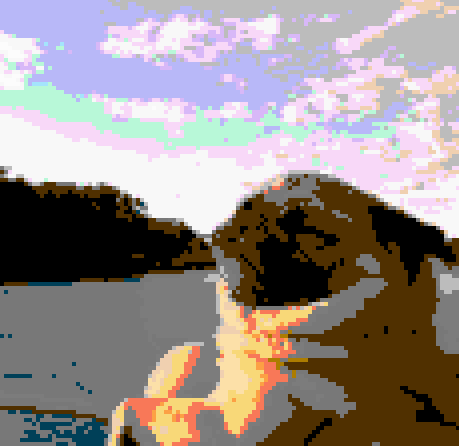

## 8bitlize your photo
If you are an 8 bit mania like me, you would like this!

## Use your photo
Change this line in main.m
```
img = double(imread('favicon.jpg'));
```
## Use other color palettes
Change these two lines in main.m.

mario_cmap.mat and nes_cmap.mat are two preset palette I found online, you can search more.
```
load('nes_cmap.mat')
palette = nes_cmap;
```